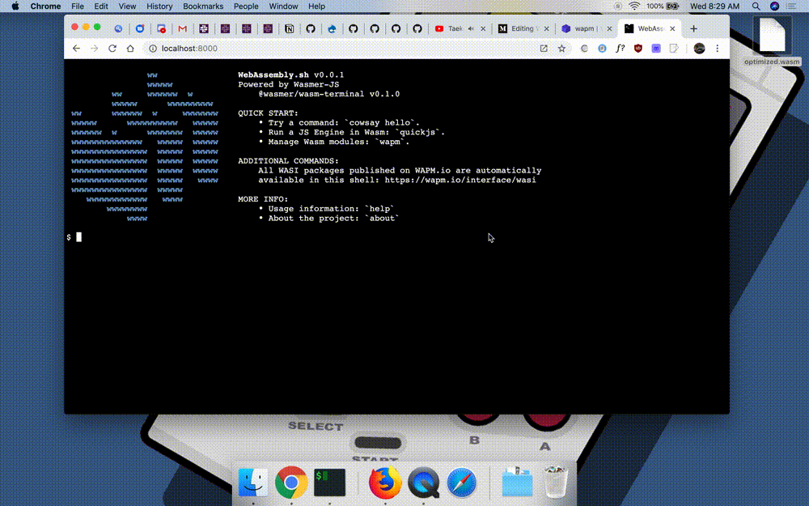

# WebAssembly.sh

Open-source and installable Progressive Web App (PWA) terminal fully powered by WebAssembly and Wasmer-JS, that uses the [WebAssembly Package Manager (WAPM)](https://wapm.io/) and local files to run server-side Wasm WASI modules in a shell-like interface  🖥

[Website](https://webassembly.sh/) - [Announcement Article](https://medium.com/wasmer/webassembly-sh-408b010c14db)

## Contributing

This project follows the [all-contributors](https://github.com/all-contributors/all-contributors) specification.

Also, please see our [Code of Conduct](./code-of-conduct.md).

This project is built using [preact-cli](https://github.com/preactjs/preact-cli). As such, follows the standard workflow from preact-cli.

Contributions of any kind are welcome! 👍

## License

[Licensed under MIT](./LICENSE)

